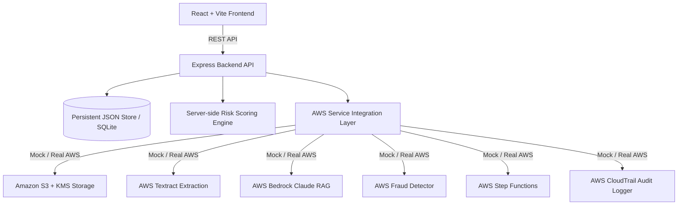

# Implementation Plan - Ledger: AI-Integrated Insurance Claims Underwriting Platform

Building a production-ready, full-stack Insurance Claims Underwriting Platform called **Ledger** based on the full spec provided in `ledger_antigravity_prompt.pdf`. The platform transforms 30-40 day manual underwriting workflows into automated, AI-assisted decision making in minutes.

## User Review Required

> [!NOTE]
> The application will be built as a full Node.js + Express backend with a React + Vite frontend. It includes full mock implementation of AWS services (Textract, Bedrock RAG, S3/KMS, SQS, Step Functions, CloudTrail, Macie, Fraud Detector, SES/SNS, QuickSight, Cognito) alongside full support for live environment variable configuration.
> 
> A top navigation **Role Switcher** is provided so you can seamlessly test and experience all 4 user roles (**Claimant**, **Underwriter**, **Senior Underwriter**, **Admin**) in real time.

## Proposed System Architecture

---

## Proposed Changes

### Backend Structure (`/server`)

#### [NEW] `server/index.js`
- Express server entry point, REST endpoints, CORS setup, port static fallback.

#### [NEW] `server/db.js`
- Persistent file database with automatic seed data initialization for the 6 core claims specified in the brief.

#### [NEW] `server/riskEngine.js`
- Implementation of the exact server-side 0-100 risk scoring rules:
  - Incident within 30 days (+40, waiting-period violation)
  - Incident within 90 days (+15, early-claim window)
  - Claim amount > 90% sum insured (+30, unusually high)
  - Claim amount > 60% sum insured (+10)
  - < 2 supporting docs (+15, insufficient verification)
  - Description < 12 words (+10, very brief)
  - Capped at 100, risk bands (0-19 Sage, 20-49 Amber, 50+ Rust).

#### [NEW] `server/awsServices.js`
- Clean interface for AWS services (Textract, Bedrock, S3, SQS, Step Functions, CloudTrail, Macie, SES/SNS, Fraud Detector, QuickSight).
- Smart mock generators producing realistic document extraction fields, clause-citing LLM summaries, and audit trail entries.

---

### Frontend Structure (`/src` or root Vite app)

#### [NEW] `package.json` & `vite.config.js`
- Vite + React, Tailwind CSS / Lucide icons / Google Fonts setup.

#### [NEW] `src/styles/theme.css`
- Design token system implementing exact PDF palette:
  - Ink (`#14213D`)
  - Paper (`#F7F6F1`)
  - Steel (`#5C6B73`)
  - Amber (`#C8862A`)
  - Sage (`#3E6E5B`)
  - Rust (`#A6394A`)
  - Custom rubber-stamp badge styles, typography imports (Fraunces, Inter, IBM Plex Mono).

#### [NEW] `src/components/Navigation.jsx` & `Header.jsx`
- Role-gated sidebar navigation, live Role Switcher (Claimant, Underwriter, Senior Underwriter, Admin), active user stats, notifications.

#### [NEW] `src/views/ClaimSubmissionView.jsx`
- "File a Claim" form: claimant details, policy drop-down, incident dates, drag-and-drop document uploader with type tagging (Bill, ID Proof, Medical Report, FIR, Photos), explicit consent checkbox, immediate submission status tracking.

#### [NEW] `src/views/UnderwriterLedgerView.jsx`
- "Underwriter Ledger" dashboard: claims data table, rubber-stamp status badges, risk score dots, workload auto-assignment, multi-filter by status, policy type, assigned underwriter, free-text search.

#### [NEW] `src/views/CaseDetailView.jsx`
- "Case Detail" comprehensive 6-panel view:
  1. Claim Summary & Core Details
  2. Textract Extracted Document Fields + S3 Document Previews
  3. Risk Assessment Panel with score flags and Fraud Detector blend
  4. Policyholder History Panel (cross-claim comparison on same policy #)
  5. Bedrock AI Summary Panel (clause-citing LLM analysis & recommendation)
  6. Underwriter Action Panel (Status update, auto-escalation, senior sign-off, investigator assignment, disbursement details).

#### [NEW] `src/views/AnalyticsView.jsx`
- "Analytics" embedded dashboard: claims status metrics, SLA turnaround time tracking (30-40 day reduction proof), risk distribution, policy type breakdown, underwriter workload balancing.

#### [NEW] `src/views/AdminView.jsx`
- "Admin Panel": user role management, CloudTrail-backed decision & access audit log viewer, auto-approval/escalation threshold settings.

---

## Verification Plan

### Automated Tests
- Server API test script (`node scripts/test-api.js`) verifying:
  1. Claim creation and risk score computation logic against test cases.
  2. Underwriter status updates, CloudTrail audit log recording, and escalation triggers.
  3. AI summary generation and mock Textract document extraction.

### Manual Verification
- Launch backend API server on port 5000 and Vite frontend on port 3000/5173.
- Test claim submission as Claimant (upload documents, accept privacy consent, verify S3 mock upload).
- Switch role to Underwriter: verify new claim appears in Underwriter Ledger with auto-assignment, rubber-stamp status badge, and calculated risk score.
- Open Case Detail: verify Textract extracted fields, Bedrock AI summary, Policyholder History panel (showing Ramesh Kumar's previous claim POL-88213), and decision workflow.
- Test escalation above monetary threshold to Senior Underwriter.
- Review Analytics SLA metrics and Admin CloudTrail audit log.
